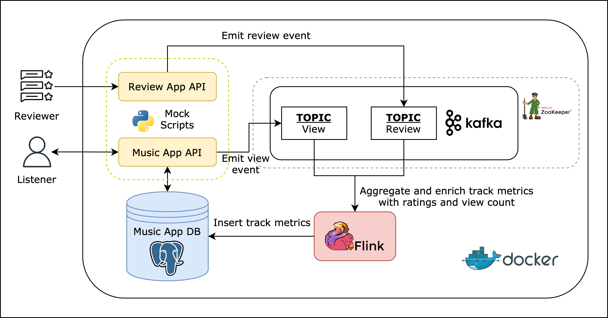

# Funk Review
A data engineering streaming project.

Suppose newly released music tracks are streamed by many different listeners at a high rate. And that these tracks are reviewed by reviewers at a high rate as well.

When listeners click on a certain track, we want to serve them with the latest view count and average rating of that track.

## Architecture


1. The review app and music app APIs are mocked by a python script that sends messages to the kafka cluster.
1. The messages emitted are review and view events. Respectively, they refer to whenever a reviewer submits a review for a track and whenever a listener clicks on a track. The messages are stored in kafka topics: Review and View.
1. A flink pipeline consumes the messages from the kafka topics, performs a full outer join between review and view events at 5 minute intervals.
1. The results are then stored in the music app database.

The initial dataset is retrieved [here](https://www.kaggle.com/datasets/nelgiriyewithana/top-spotify-songs-2023).

## Prerequisites
Versions used at the time of implementation:
* Docker version 24.0.6, build ed223bc
* Docker Compose version v2.22.0-desktop.2
* Python 3.10.1

## Setting up
1. Create a python virtual environment at the root of this project and install the requirements.
    ```sh
    python -m venv venv
    source venv/bin/activate
    pip install -r requirements.txt
    ```
1. Run `python scripts/seed.py` to create the seed data for the postgres database.
1. Run `make up` to build and start the docker containers. Use `make run` on subsequent runs. Use `make down` to teardown the containers.
1. Once the containers are up, run `make gen-reviews` and `make gen-views` to send messages to the kafka cluster.
1. Run `make flink` to start the flink pipeline. The flink UI can be accessed at localhost:8081.
1. The postgres database can be accessed with `make db-shell`.
